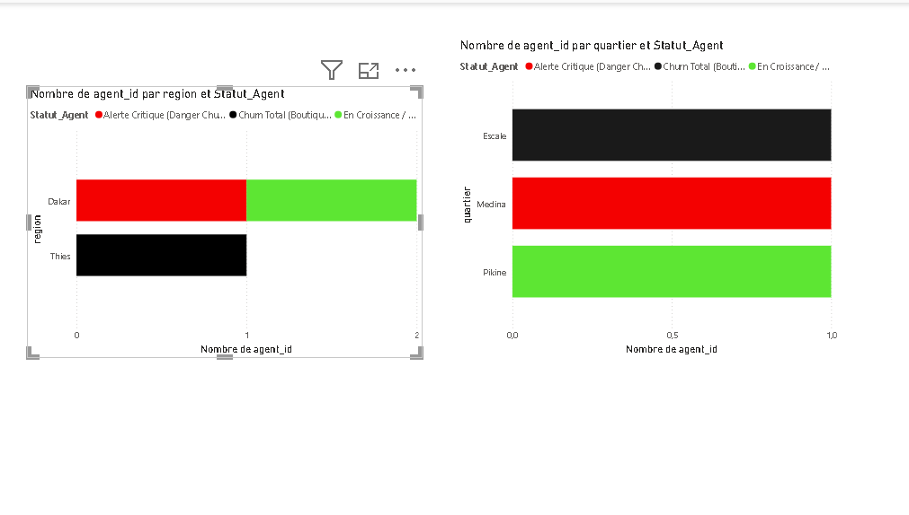

# Waxal Data - Pipeline de Détection du Churn Mobile Money au Sénégal 🇸🇳

## 💼 1. Problématique Métier (Le "Pourquoi")
Sur le marché ultra-concurrentiel du Mobile Money au Sénégal, la rentabilité dépend directement de la santé du réseau de distribution. Les agents de proximité (multiservices de quartier) sont le point de contact unique pour le rechargement (*Cash-In*) et le retrait (*Cash-Out*). 

Si un agent subit une baisse critique d'activité ou ferme sa boutique, les clients migrent instantanément vers une plateforme concurrente (Wave, Orange Money). L'objectif de ce projet est de concevoir un outil d'aide à la décision capable d'identifier proactivement les agents en situation de baisse d'activité critique pour permettre aux équipes commerciales d'intervenir sur le terrain (Médina, Pikine, Escale) avant la perte définitive de la zone.

---

## 📐 2. Architecture Technique du Projet
Le projet est architecturé selon un pipeline de production de données en 3 briques distinctes :

* **PostgreSQL** : Stockage et extraction filtrée pour maximiser les performances de requêtage.
* **Python / Pandas** : Traitement ETL, calcul vectorisé de la baisse d'activité et application des règles métiers.
* **Power BI Desktop** : Restitution visuelle et alertes géographiques pour les managers.

---

## 🛠️ 3. Implémentation des Briques du Projet

### Brique 1 : Stockage & Extraction (SQL - PostgreSQL)
La base de données relationnelle structure l'écosystème financier. Une clé étrangère avec contrainte `ON DELETE CASCADE` lie l'activité transactionnelle aux comptes fixes des agents, assurant l'intégrité référentielle du système.

```sql


SELECT t.agent_id, a.region, a.quartier, t.montant, t.mois
FROM transactions t
JOIN agents a ON t.agent_id = a.agent_id
WHERE t.mois IN (5, 6);
```


Brique 2 : Analyse & Sécurité Algorithmique (Python - Pandas)
```python
tcd['Taux_Baisse_Pct'] = np.where(
tcd['Volume_Mai'] > 0,
((tcd['Volume_Mai'] - tcd['Volume_Juin']) / tcd['Volume_Mai']) * 100,
0.0
)
```


## 🖥️ 4. Aperçu du Dashboard Power BI.




## 🖥️ 4. Aperçu du Dashboard Power BI.

